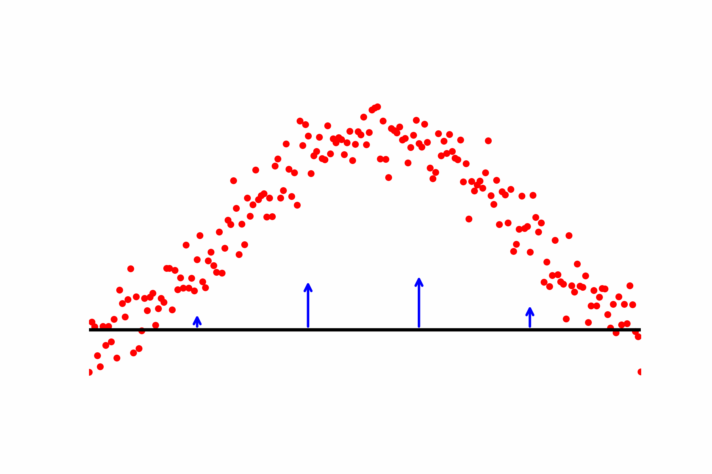

# The Genodesic Package
**A unified, score-based framework for trajectory inference in single-cell genomics.** 



This package implements the **Genodesic** as presented in my Master's Thesis "Genodesic: Trajectory Reconstruction in Single-Cell Sequencing Data using Score Based Methods" supervised by Simon Anders, Roland Herzog and Evelyn Herberg.

The method is built upon the foundational work of [Sorrenson et al. (2024)](https://arxiv.org/abs/2407.09297), who proposed using a combination of a Normalizing Flow for density estimation and a separate score matching model to compute geodesics with a data-driven Fermat metric.

The fundamental idea is that if distances are short where density is high, then geodesics  — the shortest path on a manifold under certain assumptions — go through areas supported by the data, as they will find shorter lengths there. Thus regression/trajectory inference turns into a geodesic calculation solved via relaxation (compare with the gif).

The primary contribution of this thesis is to unify this framework. While the previous work identified inconsistencies when using separate models, **Genodesic** employs a single, score-based generative model (a Variance-Preserving Stochastic Differential Equation) to learn a smoother and more stable score function. The data density is then derived directly from this unified model, creating a cohesive approach that improves the numerical stability critical for robust trajectory inference.

For the Geodesic equation to be numerically solvable we assume a continuous dataspace. As single-cell sequencing data is very high dimensional and integer based we also construct a latent-space based on a Negative-Binomial Autoencoder. 


For a broad conceptual overview see [stani-stein.com/Genodesic](https://www.stani-stein.com/Genodesic).

---

# Installation

This project relies on a specific software stack including **PyTorch**, the **NVIDIA RAPIDS** suite (`cuDF`, `cuML`), and libraries installed from various sources. To ensure perfect reproducibility and avoid complex dependency management, we **strongly recommend** using the provided Apptainer container.

> **NVIDIA Driver Prerequisite**
> Both installation methods require a Linux system with an NVIDIA GPU and a compatible NVIDIA driver. The environment is built against **CUDA 12.1**, so it's recommended to have a driver version that supports it.

## Option 1: Using the Apptainer Container (Recommended)

This is the easiest and most reliable way to get started. The container encapsulates the entire environment, guaranteeing that all package versions are correct.

### 1. Download the Container

Download the pre-built Singularity Image File (`genodesic.sif`) to your machine.
```bash
wget stani-stein.com/containers/genodesic.sif
```

### 2. Install the Jupyter Kernel
To make the container accessible in VS Code or Jupyter, you need to install the provided kernel definition. This repository includes a `jupyter_kernelspec` directory containing the necessary files.

**a.** **Copy the Kernel Directory**
    
Copy the apptainer-genodesic directory from this repository to your local Jupyter kernels folder.
    
```bash
# Assumes you are in the root of the cloned Genodesic repository
cp -r jupyter_kernelspec/apptainer-genodesic ~/.local/share/jupyter/kernels/
```
    
**b.** **Edit the Kernel Script**
    
You must edit the `run_kernel.sh` script you just copied to provide the absolute path to your `genodesic.sif` file.
    
```bash
# Open the file in your preferred editor
nvim ~/.local/share/jupyter/kernels/apptainer-genodesic/run_kernel.sh
```
Inside the file, change the `CONTAINER_PATH` variable:
    
```bash
# CHANGE THIS LINE:
CONTAINER_PATH="~/Genodesic/genodesic.sif"
    
# TO THE FULL, ABSOLUTE PATH, LIKE THIS:
CONTAINER_PATH="/home/slausmeister/Genodesic/genodesic.sif"
```
    
**c.** **Restart VS Code / Jupyter**
    
After saving the file, restart VS Code or your Jupyter server. You should now see **"Genodesic Kernel"** in your list of available kernels. The notebooks should now find all necessary imports.

**Interactive Shell Access**

If you need to run other commands or explore the environment interactively, you can start a shell inside the container:

```bash
apptainer shell --nv /path/to/your/genodesic.sif
```

### Option 2: Manual Installation (Advanced)

This method is for users who cannot use Apptainer or need to build the environment from scratch. This process is more complex and prone to errors. The steps below replicate the build process defined in the `genodesic.def` file.


**a.**  **Set up Conda/Mamba**

We recommend using [Mamba](https://github.com/mamba-org/mamba) for faster environment solving. First, install Miniforge or Miniconda if you haven't alread
**b.**  **Create Conda Environment**

Create the `genodesic` environment using the provided `environment.yml` file. This will install all base dependencies from the specified Conda channels, including Python, PyTorch, and the RAPIDS stack.
```bash
mamba env create -f environment.yml
```

**c.**  **Activate the Environment**
 ```bash
 conda activate genodesic
 ```

**d.**  **Install Additional Pip Packages**

The `torchdyn` and `torchcfm` libraries are installed via pip.
```bash
pip install --no-cache-dir torchdyn
pip install --no-cache-dir torchcfm
```

**e.**  **Install FrEIA from Source**

The FrEIA library is required and must be installed from its Git repository, as the current release is not up-to-date.
```bash
# Navigate to a location of your choice
cd /path/to/your/preferred/source/directory
    
# Clone and install FrEIA
git clone --depth 1 https://github.com/vislearn/FrEIA.git
cd FrEIA
pip install -r requirements.txt
pip install -e .
```

---


# Genodesic Tutorial Notebook

The central workflow is demonstrated in the **[Genodesic_tutorial.ipynb](Genodesic_tutorial.ipynb)**. This is the best place to start. It covers the end-to-end pipeline, from downloading the [Schiebinger dataset](https://pubmed.ncbi.nlm.nih.gov/30712874/) to inferring and evaluating a final trajectory.


The pipeline from this tutorial notebook is implemented in subscripts that can also be run independently. They are located in the `Pipeline` directory.

## Schiebinger Specific Pipeline
- [Download:](Pipeline/SchiebingerDownload.sh) A bash script that downloads and extracts the Schiebinger Dataset
- [HVG Extraction:](Pipeline/firstSelectHVGs.py) A python script that assembles all experiments into one dataset and performs the standard Bioinformatics workflow of QC and HVG extraction
- [Autoencoder Training:](Pipeline/secondTrainAutoencoder.py) A python script that both trains the NB-Autoencoder as well as creates the latent space that is to be used for downstream analysis
- [Score/Density model training:](Pipeline/train.py) A python script that can train any of the implemented Score/Density models presented in my Master's thesis

## Key Analyses & Results

The main scientific claims and model evaluations are demonstrated in two supplementary notebooks. These notebooks assume the models have already been trained (e.g., by running the tutorial).

- **[Score Evaluation](Score_stability_evaluation.ipynb):** This notebook demonstrates the superior numerical stability and computational performance of the score estimates generated by the unified VP-SDE model compared to the flow-based methods.

- **[Generative Evaluation](Generative_evaluation.ipynb):** This notebook assesses the quality of the learned data distribution by comparing generated samples against the original data, showing that the model accurately captures the underlying data manifold.


# Package Structure
- Dataloaders: Contains Dataloaders both for raw sequencing data as well as for the latentspace
- DensityModels: Contains three different Score/Density models: A [VP-SDE diffusion](https://arxiv.org/abs/2011.13456) implementation, an [OT-CFM](https://arxiv.org/abs/2302.00482) based continuous normalizing flow, as well as a [Rational-Quadratic Neural Spline FLow](https://arxiv.org/abs/1906.04032)
- LatentCell: The NB-Autoencoder
- PathTools: The heart of the Geodesic based method including path initialization, path refinements as well as path evaluations
- Utils: Utilities for loading/saving different models such that they are compatible with the rest of the package
- Visualizers: Functions calculating different plots